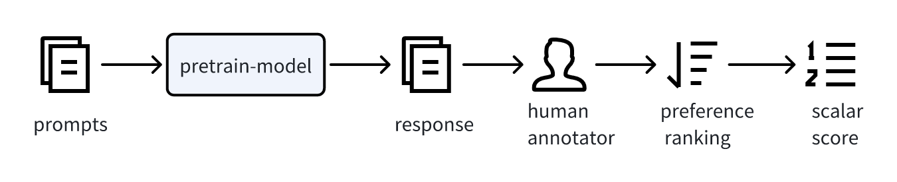
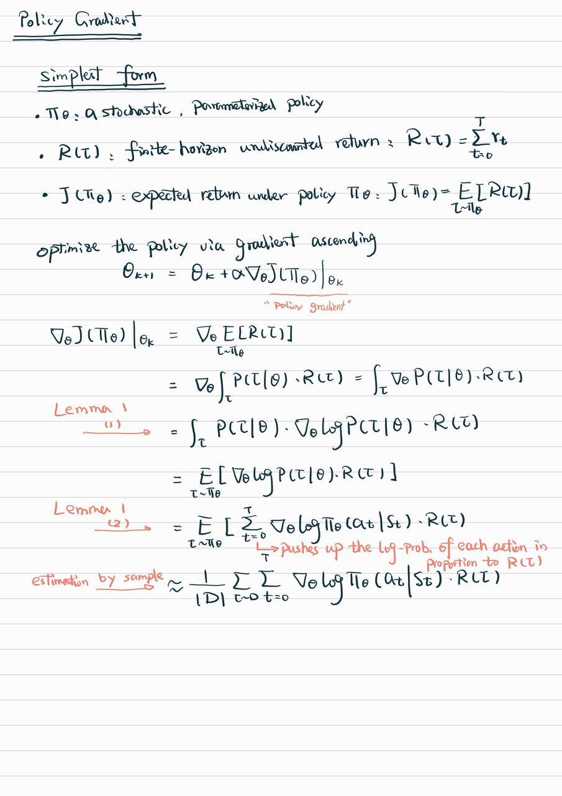
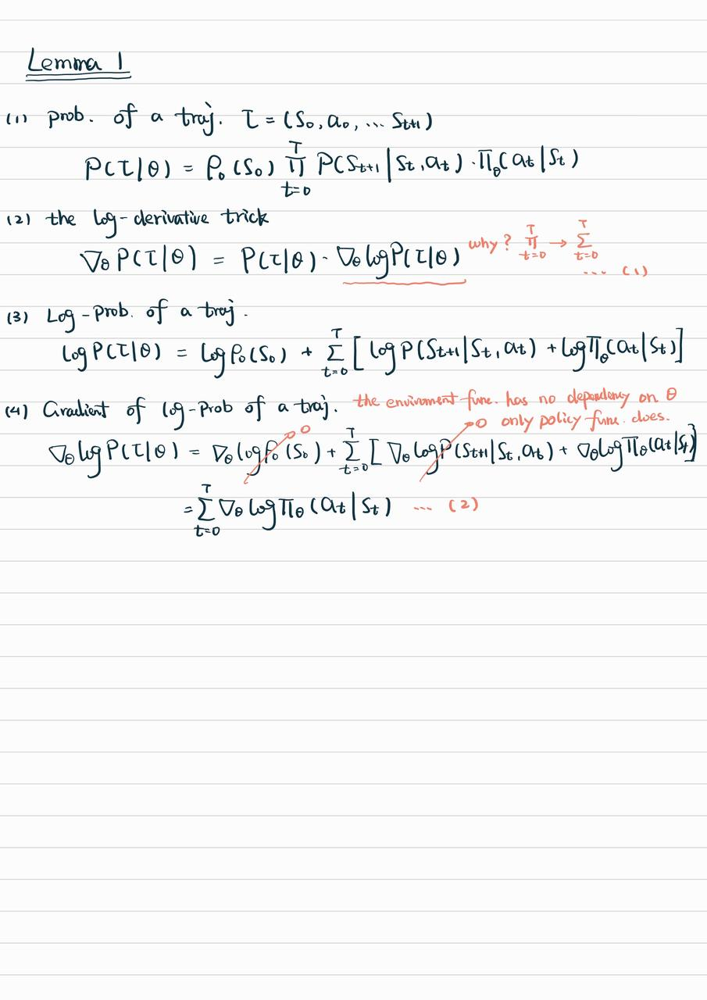
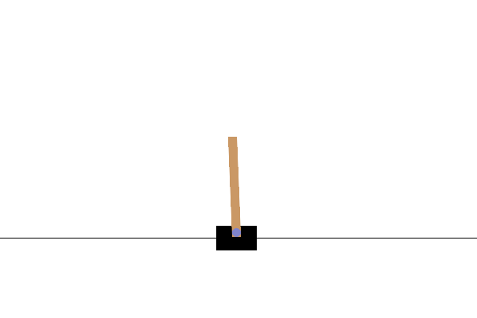
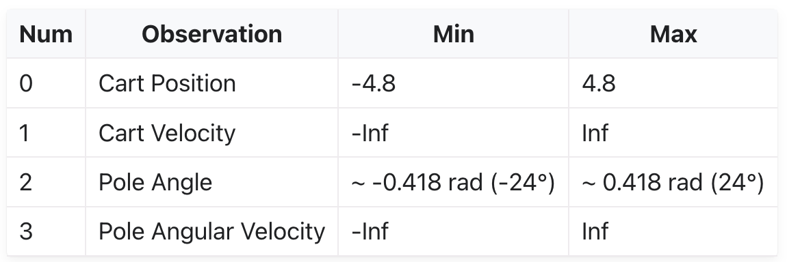
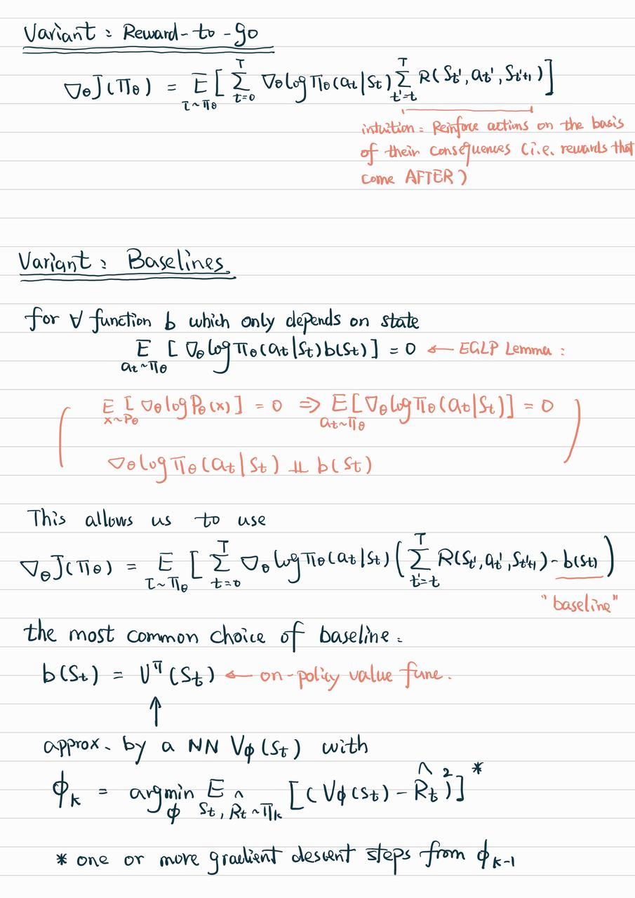
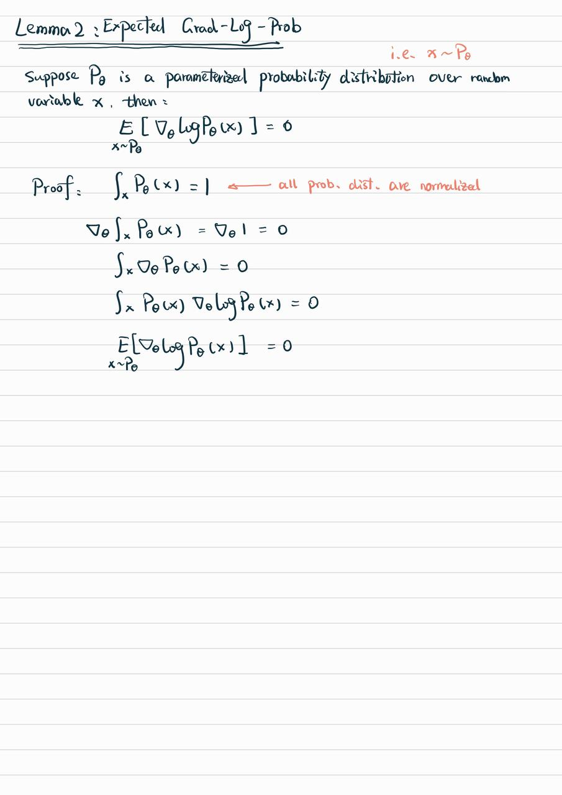
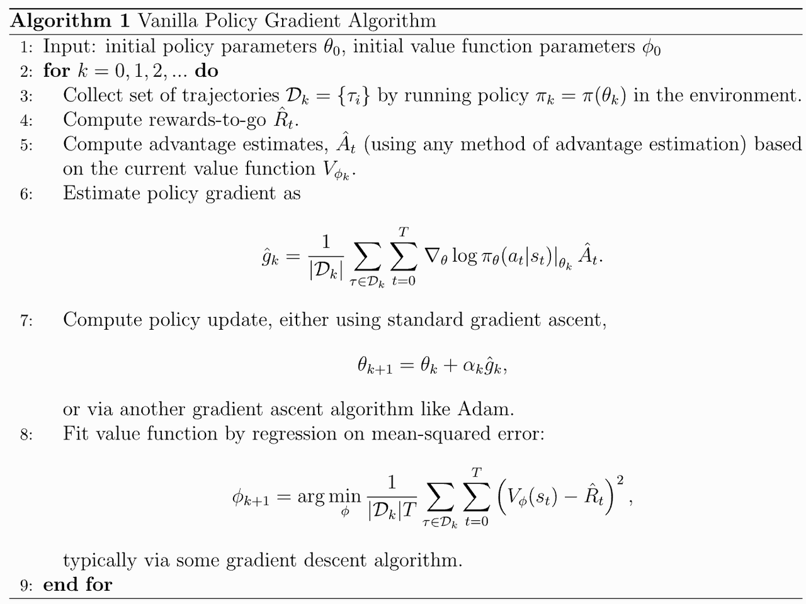
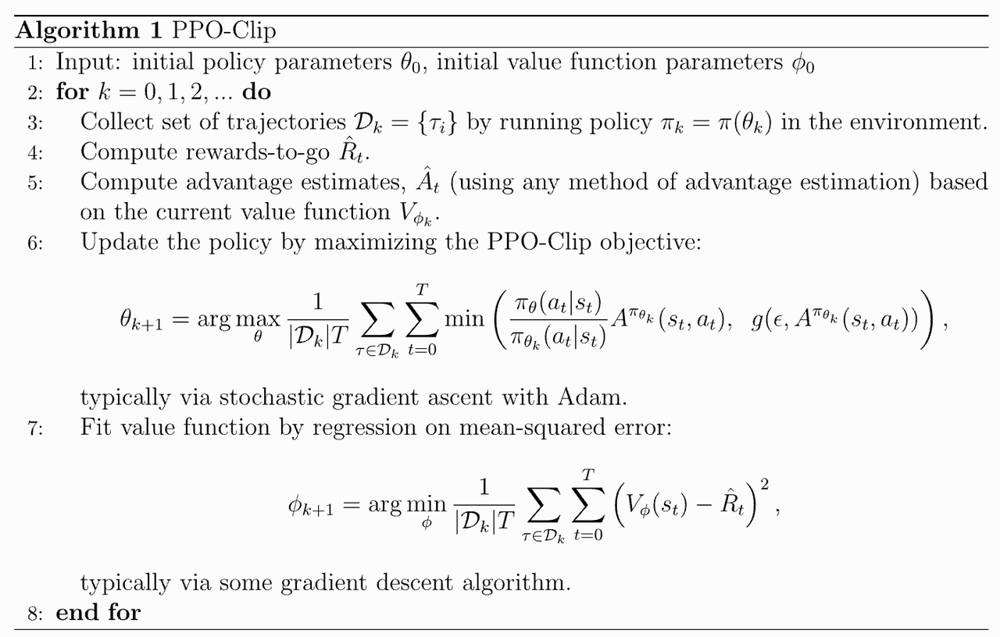

来学习一下RL的大致原理

# Overview

1. Pretraining a language model (LM),

2. gathering data and training a reward model

   

   > The underlying goal is to get a model or system that takes in a sequence of text, and returns a scalar reward which should numerically represent human preference. The system can be an end-to-end LM, or a modular system outputting a reward (e.g. a model ranks outputs, and the ranking is converted to reward). These LMs for reward modeling can be both another fine-tuned LM or a LM trained from scratch on the preference data.

3. fine-tuning the LM with reinforcement learning.

* First, the policy is a language model that takes in a prompt and returns a sequence of text (or just probability distributions over text)

* The action space of this policy is all the tokens corresponding to the vocabulary of the language model (often on the order of 50k tokens)

* the observation space is the distribution of possible input token sequences, which is also quite large given previous uses of RL (the dimension is approximately the size of vocabulary ^ length of the input token sequence)

* The reward function is a combination of the preference model and a constraint on policy shift.

# Simplest Policy Gradient

mainly refer to https://spinningup.openai.com/en/latest/spinningup/rl\_intro3.html#id7

## Theory

最简单的策略梯度形式，左边是推导，右边是所需的引理



* 优化对象：参数化的策略 $\pi_{\theta}$

* 优化目标：最大化该策略下的收益期望 $J$

* 证明过程摘要：

  a. 期望收益$J$可拆解为不同轨迹的回报$R$按照该轨迹出现的概率加权；前者与策略参数$\theta$无关，后者被$\theta$决定，等于轨迹中包含所有状态出现概率的连乘

  b. 在MDP设定下，某个状态出现概率等于该状态的前序状态下特定action的出现概率（被策略参数$\theta
     $决定）和该action出现后转移到当前状态的概率（与策略参数$\theta
     $无关）的乘积；

  c. 在logscale下，连乘可以转化为求和；

  d. 挑选a,b中所有与策略参数$\theta
     $有关的项，可知期望收益$J$相对于策略参数$\theta
     $的梯度是每个轨迹中每个状态下产生对应action的对数概率相对于$\theta
     $的梯度按照该轨迹的回报$R$加权平均

  e. 在实际中，可以通过采样并计算均值来实现

从直觉上来讲，这种策略梯度下降以每个轨迹的总回报作为权重，强化该轨迹中每个action发生的（对数）概率<- 这也是它为啥叫“强化学习”的原因吧=。=

需要特别注意的两点理解：

> Even though we describe this as a loss function, it is **not** a loss function in the typical sense from supervised learning. There are two main differences from standard loss functions.
>
> 1. **1. The data distribution depends on the parameters.** A loss function is usually defined on a fixed data distribution which is independent of the parameters we aim to optimize. Not so here, where the data must be sampled on the most recent policy.
>
> 2. **2. It doesn’t measure performance.** A loss function usually evaluates the performance metric that we care about. Here, we care about expected return, but our “loss” function does not approximate this at all, even in expectation. This “loss” function is only useful to us because, when evaluated at the current parameters, with data generated by the current parameters, it has the negative gradient of performance.
>
> But after that first step of gradient descent, there is no more connection to performance. This means that minimizing this “loss” function, for a given batch of data, has *no* guarantee whatsoever of improving expected return. You can send this loss to -inf and policy performance could crater; in fact, it usually will. Sometimes a deep RL researcher might describe this outcome as the policy “overfitting” to a batch of data. This is descriptive, but should not be taken literally because it does not refer to generalization error.
>
> We raise this point because it is common for ML practitioners to interpret a loss function as a useful signal during training—”if the loss goes down, all is well.” In policy gradients, this intuition is wrong, and you should only care about average return. The loss function means nothing

## Implementation

看一个代码原型：https://github.com/openai/spinningup/blob/master/spinup/examples/pytorch/pg\_math/1\_simple\_pg.py

学习一个策略，试图通过左右移动小车，维持其上连接的一个竖杆的平衡，竖杆倾斜超过给定角度（±24°）即算失败


* action space:  take values `{0, 1}` indicating the direction of the fixed force the cart is pushed with.
* Observation space:


* 31行构建了一个MLP作为参数化策略，size = \[4,32,2]，输入一个4维的observation向量，输出一个2维的行动向量
  ```python
  # make core of policy network
  logits_net = mlp(sizes=[obs_dim]+hidden_sizes+[n_acts])
  ```

* 51-112行的函数构建了一个epoch的训练过程：1个epoch = 1个batch list = \~50个episode = \~5000个observations，每个episode的reward即是episode结束前坚持的步数

  ```python
  def train_one_epoch():
      # make some empty lists for logging.
      batch_obs = []          # for observations
      batch_acts = []         # for actions
      batch_weights = []      # for R(tau) weighting in policy gradient
      batch_rets = []         # for measuring episode returns
      batch_lens = []         # for measuring episode lengths

      # reset episode-specific variables
      obs = env.reset()       # first obs comes from starting distribution
      done = False            # signal from environment that episode is over
      ep_rews = []            # list for rewards accrued throughout ep

      # render first episode of each epoch
      finished_rendering_this_epoch = False

      # collect experience by acting in the environment with current policy
      while True:

          # rendering
          if (not finished_rendering_this_epoch) and render:
              env.render()

          # save obs
          batch_obs.append(obs.copy())

          # act in the environment
          act = get_action(torch.as_tensor(obs, dtype=torch.float32))
          obs, rew, done, _ = env.step(act)

          # save action, reward
          batch_acts.append(act)
          ep_rews.append(rew)

          if done:
              # if episode is over, record info about episode
              ep_ret, ep_len = sum(ep_rews), len(ep_rews)
              batch_rets.append(ep_ret)
              batch_lens.append(ep_len)

              # the weight for each logprob(a|s) is R(tau)
              batch_weights += [ep_ret] * ep_len

              # reset episode-specific variables
              obs, done, ep_rews = env.reset(), False, []

              # won't render again this epoch
              finished_rendering_this_epoch = True

              # end experience loop if we have enough of it
              if len(batch_obs) > batch_size:
                  break

      # take a single policy gradient update step
      optimizer.zero_grad()
      batch_loss = compute_loss(obs=torch.as_tensor(batch_obs, dtype=torch.float32),
                                act=torch.as_tensor(batch_acts, dtype=torch.int32),
                                weights=torch.as_tensor(batch_weights, dtype=torch.float32)
                                )
      batch_loss.backward()
      optimizer.step()
      return batch_loss, batch_rets, batch_lens
  ```

* 43行的函数计算一个batch内所有observation->action的log probability，按照对应episode的reward进行加权平均，作为（当前策略下的）loss（对应policy gradient推导的最后一行）

  ```python
  # make loss function whose gradient, for the right data, is policy gradient
  def compute_loss(obs, act, weights):
      logp = get_policy(obs).log_prob(act)
      return -(logp * weights).mean()
  ```

* 104-111行使用torch的auto grad进行梯度下降，更新一步theta\*

  ```python
  # take a single policy gradient update step
  optimizer.zero_grad()
  batch_loss = compute_loss(obs=torch.as_tensor(batch_obs, dtype=torch.float32),
                            act=torch.as_tensor(batch_acts, dtype=torch.int32),
                            weights=torch.as_tensor(batch_weights, dtype=torch.float32)
                            )
  batch_loss.backward()
  optimizer.step()
  ```

\*注意，只更新一步，下一步就是一个全新的epoch，需要重新收集新theta下的episodes的数据（对应上文需要特别注意的两点理解）

运行，得到log，可以看到随着epoch的增长，平均return和平均episode长度明显增加，说明策略已经越来越好；然而loss也在逐渐增加，说明轮次与轮次之间的loss并不表征performance。

```python
epoch:   0          loss: 21.558          return: 24.325          ep_len: 24.325
epoch:   1          loss: 24.058          return: 27.076          ep_len: 27.076
epoch:   2          loss: 28.118          return: 32.064          ep_len: 32.064
epoch:   3          loss: 29.303          return: 32.374          ep_len: 32.374
epoch:   4          loss: 29.208          return: 34.951          ep_len: 34.951
epoch:   5          loss: 32.174          return: 36.890          ep_len: 36.890
……
epoch:  40          loss: 130.750          return: 202.360          ep_len: 202.360
epoch:  41          loss: 150.477          return: 222.870          ep_len: 222.870
epoch:  42          loss: 134.909          return: 233.545          ep_len: 233.545
epoch:  43          loss: 184.070          return: 300.647          ep_len: 300.647
epoch:  44          loss: 178.090          return: 300.235          ep_len: 300.235
epoch:  45          loss: 263.423          return: 425.667          ep_len: 425.667
epoch:  46          loss: 267.786          return: 470.091          ep_len: 470.091
epoch:  47          loss: 558.878          return: 836.333          ep_len: 836.333
epoch:  48          loss: 541.108          return: 685.700          ep_len: 685.700
epoch:  49          loss: 452.700          return: 635.750          ep_len: 635.750
```

对比训练前和训练后的策略，可以看出训练后策略显著更好地掌握了平衡，长时间将竖杆维持在规定倾斜范围（±24°）之内（1s vs. 10s）

# Other Forms of the Policy Gradient

## Reward-to-go Policy Gradient and Baselines

本节介绍policy gradient的两个常见变种，它们都起到了降低估计方差和所需轨迹样本量的效果，右边是所需的引理。



* Reward-to-go (RTG)：

Inutition: Taking a step with this gradient pushes up the log-probabilities of each action in proportion to the sum of ***all rewards** ever obtained*. But this doesn’t make much sense. Agents should really only reinforce actions on the basis of their ***consequences***. Rewards obtained before taking an action have no bearing on how good that action was: **only rewards that come *after*.**

But how is this better? A key problem with policy gradients is how many sample trajectories are needed to get a low-variance sample estimate for them. The formula we started with included terms for reinforcing actions proportional to past rewards, all of which had zero mean, but nonzero variance: as a result, they would just add noise to sample estimates of the policy gradient. By removing them, we** reduce the number of sample trajectories needed.**

* Baselines

总体来说，Lemma2允许我们在期望收益梯度的formula中的reward项后加上任意只和state有关（和策略参数$\theta
$无关）的函数，而不改变期望。

Intuition: The most common choice of baseline is the [on-policy value function](https://spinningup.openai.com/en/latest/spinningup/rl_intro.html#value-functions) (the average return an agent gets if it starts in state and then acts according to policy for the rest of its life.) Empirically, the choice has the desirable effect of **reducing variance** in the sample estimate for the policy gradient. This results in faster and more stable policy learning. It is also appealing from a conceptual angle: it encodes the intuition that **if an agent gets what it expected, it should “feel” neutral about it.** -> 它们之间若有正差值，说明此次选择的行为是优于当前策略在当前状态下的“平均行为”的，应当予以加强，反之应予以抑制

In practice, the on-policy value function **cannot be computed exactly**, so it has to be **approximated**. This is usually done with a **neural network** which is updated concurrently with the policy.

## Advantage

目前为止，以上章节中的梯度公式都可以写成下述形式

$$\nabla_{\theta} J\left(\pi_{\theta}\right) = \mathbb{E}_{\tau \sim \pi_{\theta}}\left[\sum_{t=0}^{T} \nabla_{\theta} \log \pi_{\theta}\left(a_{t} \mid s_{t}\right) \Phi_{t}\right]$$

其中$\Phi_{t}$可以是轨迹的总回报，也可以是RTG，也可以是RTG-baseline的形式。实际上，还有以下两种形式也是valid并且经常被用到的

* **On-Policy Action-Value Function：**

$$\Phi_{t} = Q^{\pi_{\theta}}\left(s_{t}, a_{t}\right)$$

> [Remind](https://spinningup.openai.com/en/latest/spinningup/rl_intro.html): The On-Policy Action-Value Function gives the expected return if you start in state, take an arbitrary action (which may not have come from the policy) and then forever after act according to policy.

证明见[这里](https://spinningup.openai.com/en/latest/spinningup/extra_pg_proof2.html)，若略去过程，总之我们可以承认下式，即Q function作为乘子，仍然可以正确获得期望收益的梯度

$$\nabla_{\theta} J\left(\pi_{\theta}\right) = \mathbb{E}_{\tau \sim \pi_{\theta}}\left[\sum_{t=0}^{T} \left(\nabla_{\theta} \log \pi_{\theta}\left(a_{t} \mid s_{t}\right)\right) Q^{\pi_{\theta}}\left(s_{t}, a_{t}\right)\right]$$

* **The Advantage Function:**

$$A^{\pi}\left(s_{t}, a_{t}\right) = Q^{\pi}\left(s_{t}, a_{t}\right) - V^{\pi}\left(s_{t}\right)$$

> Remind: sometimes in RL, we don’t need to describe how good an action is in an absolute sense, but only how much better it is than others on average. That is to say, we want to know the relative advantage of that action. We make this concept precise with the advantage function.

证明：容易知道，在On-Policy Action-Value Function成立后，Lemma2保证了advantage function也成立

Openai spinup库的 [*vanilla policy gradient*](https://spinningup.openai.com/en/latest/algorithms/vpg.html#id1) 类就使用advantage function进行了实现，此处有一个概念：

> VPG trains a stochastic policy in an** on-policy **way. This means that it explores by sampling actions according to the latest version of its stochastic policy.



# Proximal Policy Optimization (PPO)

vanilla policy gradient 在使用的过程中，会观察到一旦学习率过大，single bad step can collapse policy performance，因此诞生了PPO和TRPO (trust-region policy optimization) 这一类算法，本质上都是improve a policy without stepping so far that we accidentally cause performance collapse，要求单步迭代后的策略和迭代前差距不要过大。最容易想到的penalty当然是KL divergence，事实上也确实可以这么做，但这里先介绍一个更常用也更简单的实现：PPO-clip。

$$\theta_{k+1} = \arg\max_{\theta} \mathbb{E}_{s, a \sim \pi_{\theta_k}} \left[ \mathbb{E}_{\theta_k} \left[ L\left(s, a, \theta_k, \theta\right) \right] \right]$$

其中

$$L\left(s, a, \theta_{k}, \theta\right) = \min\left(\frac{\pi_{\theta}(a \mid s)}{\pi_{\theta_{k}}(a \mid s)} A^{\pi_{\theta_{k}}}(s, a), \quad g\left(\epsilon, A^{\pi_{\theta_{k}}}(s, a)\right)\right)$$

$$g(\epsilon, A) = \left\{
\begin{array}{ll}
(1 + \epsilon) A & \text{if } A \geq 0, \\
(1 - \epsilon) A & \text{if } A < 0.
\end{array}
\right.$$

看起来挺复杂，拆解一下来理解：

如果当前(s,a)的advantage>0，上面的式子变成：

$$L\left(s, a, \theta_{k}, \theta\right) = \min\left(\frac{\pi_{\theta}(a \mid s)}{\pi_{\theta_{k}}(a \mid s)}, (1+\epsilon)\right) A^{\pi_{\theta_{k}}}(s, a)$$

对比一下VPG的式子，主要有两点不同：

1. $\pi_{\theta}$相关项由当前步变成了当前步与下一步的概率比值（多了一个分母），并且去掉了log scale -> 从intuition上，仍然是使用advantage来boost正确的action发生的概率（准确地说，相对于上一版策略的相对概率）；相对值的引入以及logscale的删除在数学推导上导致什么结果，还没有严密地看过，先留在这。

   > Quote from gpt-o1: The PPO formula leads to a valid optimization objective by providing a surrogate loss function that approximates the policy gradient while incorporating mechanisms to ensure stability and efficiency. The removal of the logarithm and the introduction of the probability ratio and clipping are deliberate modifications to address practical challenges in policy optimization.
   >
   > * **Theoretical Justification**: PPO's objective can be justified as a practical approximation to optimizing the expected return with constraints, similar to TRPO.
   >
   > * **Practical Effectiveness**: PPO strikes a balance between theoretical soundness and empirical performance, making it a widely adopted algorithm in reinforcement learning.

2. 多了一个$\epsilon
   $项 -> 这个就是clip的意思，用这个超参给收益加上一个cap，避免步子太大。

如果当前(s,a)的advantage < 0，推导是类似的，这个目标函数会抑制不正确的action发生的概率，就不赘述了。

看一个伪代码实现：




# Ref

https://huggingface.co/blog/rlhf

https://huggingface.co/learn/deep-rl-course/en/unitbonus3/rlhf

https://spinningup.openai.com/en/latest/algorithms/ppo.html

https://spinningup.openai.com/en/latest/spinningup/rl\_intro3.html

