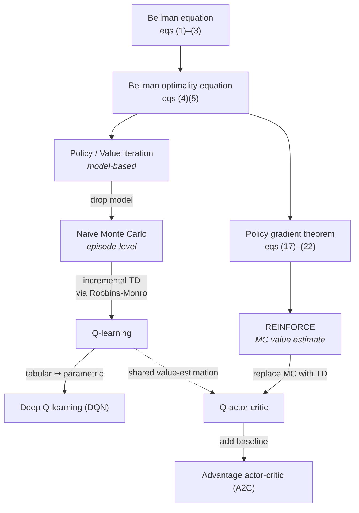

## Overview

This post lays out the mathematical foundations of reinforcement learning,
following three principles:

1. **Minimalism**: Cover only the essential concepts and algorithms, omitting variants and extensions.
2. **Clarity**: Define algorithms with equations rather than prose, for precision.
3. **Structure**: Present their intrinsic connections and developmental progression.

The core problem in reinforcement learning is to find the optimal *policy* in an *environment*
modeled as a *Markov decision process*, so as to maximize the expected return. There are two main approaches:

1. **Value-based**: Describe the value $q(s,a)$ of each (state, action) pair. The optimal policy is then
   derived implicitly — in each state, take the action with maximum $q(s,a)$. These methods belong to
   classical reinforcement learning theory, solved through dynamic programming to achieve the Bellman optimality equation.
2. **Policy-based**: Directly parameterize the policy itself — $\pi(a|s)$ specifies the action distribution
   given state $s$. This frames learning as a direct optimization problem: maximize expected return via
   gradient ascent on the policy parameters.

These two approaches are unified by the **actor-critic** framework, which underlies most modern
reinforcement learning algorithms.

The lineage of algorithms covered in this post:



The left branch (value-based) progressively drops assumptions — model, then full
episodes, then tabular form — to arrive at deep Q-learning. The right branch
(policy-based) sets up policy gradient and inherits value-estimation techniques
from the left branch via the actor-critic framework.

## Value-based methods

### Bellman Equation

In an MDP, the value of a state under a policy $\pi$ is the expected discounted return
obtained by following $\pi$ from that state. This return splits into an immediate reward
and a discounted future return; the latter is, in expectation, the value of the next state
under $\pi$. The recursion yields an equation relating $v_\pi(s)$ to the values of its successor states:

$$
\begin{aligned}
v_{\pi}(s) &= \sum_{a} \pi(a|s) \left[ \sum_{r} P(r|s,a) \cdot r + \gamma \sum_{s'} P(s'|s,a) v_{\pi}(s') \right] \\
&= \mathbb{E}[R + \gamma v_{\pi}(s')]
\end{aligned} \tag{1}
$$

This is the *Bellman Equation*. It has a dual form for action values, relating
$q_\pi(s,a)$ to the values at successor (state, action) pairs:

$$
\begin{aligned}
q_{\pi}(s,a) &= \sum_{r} P(r|s,a) \cdot r + \gamma \sum_{s'} P(s'|s,a) v_{\pi}(s') \\
&= \sum_{r} P(r|s,a) \cdot r + \gamma \sum_{s', a'} P(s'|s,a) \pi(a'|s') q_{\pi}(s',a') \\
&= \mathbb{E}[R + \gamma q_{\pi}(s',a')]
\end{aligned} \tag{2}
$$

The two are related by:

$$
v_{\pi}(s) = \sum_{a} \pi(a|s) q_{\pi}(s,a) \tag{3}
$$

### Optimality of Bellman Equation

State values depend on the policy: the same state takes different values under
different policies. There exists a policy whose value at every state is at
least as large as under any other policy — the *optimal policy*.

Substituting the optimal policy into the Bellman equation, the optimal state
value function satisfies:

$$
v = \max_{\pi} \left( r_{\pi} + \gamma P_{\pi} v \right) \tag{4}
$$

where $v \in \mathbb{R}^{|\mathcal S|}$ stacks $v(s)$ over states; $r_\pi$ and
$P_\pi$ are the expected immediate-reward vector and state-transition matrix
induced by $\pi$, with $(r_\pi)_s = \sum_a \pi(a|s) \sum_r P(r|s,a)\, r$ and
$(P_\pi)_{s,s'} = \sum_a \pi(a|s) P(s'|s,a)$.

This is the *Bellman optimality equation* (BOE), in its state-value form. The
dual form for action values, with $q \in \mathbb{R}^{|\mathcal S||\mathcal A|}$
stacked over $(s,a)$, is:

$$
q = r + \gamma P\, \max_a q \tag{5}
$$

where $r_{(s,a)} = \sum_r P(r|s,a)\, r$, $P_{(s,a), s'} = P(s'|s,a)$, and
$\max_a q$ denotes the vector of state-wise maxima,
$(\max_a q)_s = \max_{a'} q(s, a')$.

The BOE *defines* the optimum; everything that follows is about how to solve
it, along two axes:

1. **Solution method.** Value iteration (requires the environment model) →
   Monte Carlo learning (model-free, sample-based) → temporal difference
   (incremental, more efficient), culminating in *Q-learning*.
2. **Representation of $v(s)$ and $q(s,a)$.** Discrete tabular form →
   parametric (function-approximation) form, which is compact and generalizes
   across states. Combined with axis 1, this yields *deep Q-learning*.

### Solve BOE

#### Iteration Methods

When the environment model — $P(r|s,a)$ and $P(s'|s,a)$ — is known, the BOE can be
solved by direct iteration. The three methods below are all underpinned by the
*Contraction Mapping Theorem*, which guarantees their convergence.

##### Policy evaluation

The Bellman equation (1) is a linear system in $v$ and could in principle be solved
by matrix inversion, but for large state spaces this is computationally prohibitive.
An iterative fixed-point procedure is used instead:

$$
v_{k+1} = r_{\pi} + \gamma P_{\pi} v_{k} \tag{6}
$$

Starting from any initial $v_0$, this iteration converges (in the limit) to the value
function $v_\pi$ of the given policy $\pi$. The procedure is called *policy evaluation*.

The BOE (4) is harder, because $v$ and $\pi$ are coupled — both are unknown. It can
still be solved iteratively: initialize one side, alternate updates between $v$ and $\pi$,
and the procedure converges.

##### Value iteration

Initializing $v$ gives *value iteration*. At iteration $k$:

1. **Q computation.** For each state $s$, compute $q_k(s, a)$ from $v_k$:

   $$
   q_k(s,a) = \sum_{r} P(r|s,a)\, r + \gamma \sum_{s'} P(s'|s,a)\, v_k(s') \tag{7}
   $$

2. **Policy improvement.** By eq. (3), $v(s)$ is a $\pi$-weighted average of $q(s,a)$;
   it is maximized by putting all weight on the action with the largest $q$ — the
   greedy policy:

   $$
   \pi_{k+1}(a|s) =
   \begin{cases}
   1 & a = a_k^*(s) \\
   0 & a \neq a_k^*(s)
   \end{cases} \quad \text{where } a_k^*(s) = \arg\max_a q_k(s, a). \tag{8}
   $$

3. **Value update.**

   $$
   v_{k+1}(s) = \max_{a} q_k(s, a) \tag{9}
   $$

   The relation $v_{k+1} = f(v_k)$ here is an iteration map, not the fixed-point Bellman
   equation $v_\pi = f(v_\pi)$. So intermediate $v_k$ is not the value function of any
   policy; only at convergence (when $v_{k+1} = v_k$) does it coincide with $v^*$.

Repeat until $\|v_{k+1} - v_k\|$ is negligible. The limit is the optimal state value; the
corresponding optimal policy is the (deterministic greedy) $\pi_{k+1}$ from (8).

##### Policy iteration

Symmetrically, we can iterate starting from a policy. *Policy iteration* repeats, at
iteration $k$:

1. **Policy evaluation.** Compute $v_{\pi_k}$ for the current policy $\pi_k$ by iterating
   (6) to convergence.
2. **Policy improvement.** Compute $q_{\pi_k}(s,a)$ from $v_{\pi_k}$ via (7), and update
   to the greedy policy $\pi_{k+1}$ as in (8).

Repeat until $\pi$ stabilizes. Each outer step contains an inner loop (the full policy
evaluation), so policy iteration is more expensive per outer step than value iteration,
but typically converges in fewer outer steps.

#### Monte Carlo Learning

In practice, the environment model — $P(s'|s,a)$ and $P(r|s,a)$ — is often unknown,
making value/policy iteration inapplicable, since both depend on the model to compute
action values. Action values can instead be estimated by empirical sampling, leading
to a class of model-free methods collectively called *Monte Carlo learning*.

##### Naive Monte Carlo

Recall that policy iteration is essentially driven by computing $q_\pi(s,a)$: once we
have it, the optimal policy is deterministic greedy w.r.t. $q$. By definition,
$q_\pi(s,a)$ is the expected discounted return obtained by taking action $a$ in state
$s$ and then following $\pi$ — so it can be estimated by averaging the returns of many
episodes sampled from $(s,a)$ under $\pi$.

```
Initialization: Initial guess π₀.

Aim: Search for an optimal policy.

While the value estimate has not converged, for the kᵗʰ iteration, do
    For every state s ∈ S, do
        For every action a ∈ A(s), do
            Collect sufficiently many episodes starting from (s, a) following π_k

    MC-based policy evaluation step:
        q_{π_k}(s, a) = average return of all the episodes starting from (s, a)

    Policy improvement step:
        a_k*(s) = argmaxₐ q_{π_k}(s, a)
        π_{k+1}(a|s) = 1 if a = a_k*(s) and π_{k+1}(a|s) = 0 otherwise
```

##### Temporal-Difference

Monte Carlo learning requires a complete episode before each update, which is
inefficient in practice. We can replace the episode-level update with an
incremental, step-by-step one. The mathematical tool is the following lemma.

###### Lemma: Robbins-Monro

```
Problem: Find root of g(w) = 0
Given: Noisy observations g̃(w, η) = g(w) + η

Algorithm (Robbins-Monro):
    w_{k+1} = w_k - a_k*g(w_k, η_k),   k = 1, 2, 3, ...

Convergence Conditions:
(a) 0 < c₁ ≤ ∇g(w) ≤ c₂ for all w        (monotonicity & bounded gradient)
(b) ∑a_k = ∞ and ∑a_k² < ∞              (step sizes decay appropriately)
(c) E[η_k|H_k] = 0 and E[η_k²|H_k] < ∞   (zero-mean, finite variance noise)
    where H_k = {w_k, w_{k-1}, ...}
```

*Discussion:*

(a) The bound $0 < c_1 \le \nabla g(w)$ makes $g$ strictly increasing, ensuring
the root of $g(w)=0$ exists and is unique; $\nabla g(w) \le c_2$ bounds the
gradient from above. For example, $g(w) = w$ trivially satisfies both bounds;
$g(w) = w^3 - 5$ fails the upper bound since $\nabla g = 3w^2$ is unbounded.

(b) The step-size condition requires $a_k \to 0$ but not too fast. A typical
choice is $a_k = 1/k$.

(c) The noise condition is mild.

**Summary:** RM finds the root of a monotonic function from noisy observations
alone, without requiring access to its analytic form or gradient.

The intuition: since $g$ is increasing through zero at the root $w^*$,
$\mathrm{sign}\bigl(g(w_k)\bigr) = \mathrm{sign}(w_k - w^*)$, so the update
$w_{k+1} = w_k - a_k \tilde g(w_k, \eta_k)$ pulls $w$ toward $w^*$ in expectation:

- if $w_k > w^*$, then $\mathbb{E}[\tilde g(w_k, \eta_k)] = g(w_k) > 0$, so the step is **negative** and $w$ decreases;
- if $w_k < w^*$, then $\mathbb{E}[\tilde g(w_k, \eta_k)] = g(w_k) < 0$, so the step is **positive** and $w$ increases.

The two parts of condition (b) are complementary: $\sum a_k = \infty$ keeps the
iterate moving when far from $w^*$, while $\sum a_k^2 < \infty$ shrinks the
steps fast enough for the noise to average out near $w^*$.

As an application, RM can incrementally estimate an expectation $\mathbb{E}[X]$
by setting

$$
g(w) = w - \mathbb{E}[X] \tag{10}
$$

For a sample $x$ of $X$,

$$
\tilde{g}(w, \eta) = w - x = (w - \mathbb{E}[X]) + (\mathbb{E}[X] - x) \triangleq g(w) + \eta \tag{11}
$$

so the root of $g(w)$ — namely $\mathbb{E}[X]$ — can be estimated by

$$
w_{k+1} = w_k - \alpha_k \tilde{g}(w_k, \eta_k) = w_k - \alpha_k(w_k - x_k) \tag{12}
$$

RM is also the foundation of *stochastic gradient descent*: an optimization
problem $\min_w J(w)$ becomes a root-finding problem $g(w) = \nabla J(w) = 0$,
and the strict monotonicity of $g$ corresponds to (strong) convexity of $J$ —
a standard assumption.

###### Q-learning

Apply RM (12) to the action-value BOE, treating $q$ as the unknown root and
the bracketed expression as a noisy estimate of the optimum:

$$
q(s, a) = \mathbb{E}\left[R_{t+1} + \gamma \max_{a'} q(S_{t+1}, a') \mid S_t = s, A_t = a\right] \tag{13}
$$

This gives the algorithm below. Unlike Monte Carlo, which must finish an
episode to compute a return, here each step uses the *TD error* — the
difference between the current estimate and the (noisy) one-step target — to
update incrementally. The general scheme is *temporal-difference learning*;
the variant solving for optimal action values is *Q-learning*.

```
Initialize q₀(s,a) for all s ∈ S, a ∈ A (randomly or to zero)
Initialize behavior policy πᵦ

Repeat (for each episode):
    Generate episode {s₀, a₀, r₁, s₁, a₁, r₂, ...} using πᵦ

    For each step t = 0, 1, 2, ... of the episode, do

        Update q-value:
        qₜ₊₁(sₜ, aₜ) = qₜ(sₜ, aₜ) + αₜ(sₜ, aₜ)[rₜ₊₁ + γ max_{a'} qₜ(sₜ₊₁, a') − qₜ(sₜ, aₜ)]

        Update target policy:
        πₜ₊₁(a|sₜ) = 1 if a = arg max_{a'} qₜ₊₁(sₜ, a')
        πₜ₊₁(a|sₜ) = 0 otherwise

Until convergence (or maximum number of episodes reached)
```

### Parametric value functions

So far we have treated $v(s)$ and $q(s,a)$ as discrete tables. When the state
and action spaces are large, this is impractical: storing the table is
infeasible, and it offers no generalization across similar states. The remedy
is to replace the table with a *parametric function*.

Let $\hat{q}(s, a; w)$ denote a parametric approximation of $q(s,a)$. To make
it accurate, minimize the mean-squared error:

$$
\min_w \; \mathbb{E}\!\left[\bigl(q(s,a) - \hat{q}(s,a;w)\bigr)^2\right] \tag{14}
$$

Gradient descent gives:

$$
w_{t+1} = w_t + \alpha_t \bigl[q(s,a) - \hat{q}(s,a;w_t)\bigr] \nabla_w \hat{q}(s,a;w_t) \tag{15}
$$

We don't have access to the true target $q(s,a)$, but by the TD-learning idea
of (13), $r_{t+1} + \gamma \max_{a'} \hat{q}(s_{t+1}, a'; w_t)$ is a noisy
estimate of it. Substituting:

$$
w_{t+1} = w_t + \alpha_t \bigl[r_{t+1} + \gamma \max_{a'} \hat{q}(s_{t+1}, a'; w_t) - \hat{q}(s,a;w_t)\bigr] \nabla_w \hat{q}(s,a;w_t) \tag{16}
$$

This is the parametric form of Q-learning; with $\hat{q}$ implemented as a deep
neural network, it is *deep Q-learning* (DQN). Two practical tricks —
*experience replay* and a periodically-synced *target network* — are added in
the standard implementation:

```
Deep Q-learning (off-policy version)

Initialization: A main network and a target network with the same initial parameter.

Goal: Learn an optimal target network to approximate the optimal action values from 
the experience samples generated by a given behavior policy πb.

Store the experience samples generated by πb in a replay buffer B = {(s, a, r, s')}

For each iteration, do
    Uniformly draw a mini-batch of samples from B
    
    For each sample (s, a, r, s'), calculate the target value as 
    yT = r + γ max_{a∈A(s')} q̂(s', a, wT), where wT is the parameter of the target network
    
    Update the main network to minimize (yT - q̂(s, a, w))² using the mini-batch 
    of samples
    
    Set wT = w every C iterations
```

## Policy-based methods

Parametrization is not limited to value functions; the policy itself can be
parametrized: $\pi(a_i|s_k)$ as a table $\to \pi(a|s,\theta)$ as a function of
$\theta$. Given any scalar measure of policy quality, we then optimize $\theta$
directly by gradient ascent. A standard choice is the *average state value*,
weighted by the stationary distribution $\eta_\pi$ of the Markov chain induced
by $\pi$:

$$
J(\theta) = \sum_{s \in \mathcal S} \eta_\pi(s)\, v_\pi(s) = \sum_{s \in \mathcal S} \eta_\pi(s) \sum_{a \in \mathcal A} \pi(a|s, \theta)\, q_\pi(s, a) \tag{17}
$$

By the *policy gradient theorem*, the gradient simplifies to the form below
(the contribution from $\nabla_\theta \eta_\pi$ cancels out):

$$
\nabla_\theta J(\theta) = \sum_{s \in \mathcal S} \eta_\pi(s) \sum_{a \in \mathcal A} \nabla_\theta \pi(a|s, \theta)\, q_\pi(s, a) \tag{18}
$$

This sum is intractable for large $|\mathcal S|, |\mathcal A|$, but the
log-derivative trick

$$
\nabla_\theta \pi(a|s, \theta) = \pi(a|s, \theta)\, \nabla_\theta \ln \pi(a|s, \theta) \tag{19}
$$

rewrites (18) as

$$
\nabla_\theta J(\theta) = \sum_{s \in \mathcal S} \eta_\pi(s) \sum_{a \in \mathcal A} \pi(a|s, \theta)\, \nabla_\theta \ln \pi(a|s, \theta)\, q_\pi(s, a) \tag{20}
$$

i.e., as an expectation:

$$
\nabla_\theta J(\theta) = \mathbb{E}_{s \sim \eta_\pi,\, a \sim \pi(\cdot|s, \theta)} \left[ \nabla_\theta \ln \pi(a|s, \theta)\, q_\pi(s, a) \right] \tag{21}
$$

We can therefore estimate it from a sample $(s_t, a_t)$ and perform stochastic
gradient ascent:

$$
\theta_{t+1} = \theta_t + \alpha\, q_t(s_t, a_t)\, \nabla_\theta \ln\pi(a_t|s_t, \theta_t) = \theta_t + \alpha\, \frac{q_t(s_t, a_t)}{\pi(a_t|s_t, \theta_t)}\, \nabla_\theta \pi(a_t|s_t, \theta_t) \tag{22}
$$

The first form increases the probability of actions with higher $q$; the
equivalent second form (with $q/\pi$) shows that less-visited actions get
amplified updates — a built-in exploration mechanism.

Combining (22) with Monte Carlo estimates of $q_t(s_t, a_t)$ yields the
*REINFORCE* algorithm:

```
Pseudocode: Policy Gradient by Monte Carlo (REINFORCE)

Initialization: A parameterized function π(a|s, θ), γ ∈ (0, 1), and α > 0.

Aim: Search for an optimal policy maximizing J(θ).

For the kth iteration, do
    Select s₀ and generate an episode following π(θₖ). Suppose the 
    episode is {s₀, a₀, r₁, ..., sₜ₋₁, aₜ₋₁, rₜ}.
    
    For t = 0, 1, ..., T - 1, do
        Value update: qₜ(sₜ, aₜ) = Σ(k=t+1 to T) γ^(k-t-1) rₖ
        
        Policy update: θₜ₊₁ = θₜ + α ∇θ ln π(aₜ|sₜ, θₜ) qₜ(sₜ, aₜ)
    
    θₖ = θₜ
```

## Actor-critic framework

REINFORCE is policy-based, but each update relies on a value estimate
$q_t(s_t, a_t)$. REINFORCE uses Monte Carlo for this estimate; replacing it
with other value-based methods yields the *actor-critic* family.

### Q-actor-critic

Using TD-learning instead of Monte Carlo, with a policy network and a Q-network
fit jointly, gives *Q-actor-critic*:

```
Pseudocode: The simplest actor-critic algorithm (QAC)

Initialization: A policy function π(a|s, θ₀) where θ₀ is the initial parameter. A value 
function q(s, a, w₀) where w₀ is the initial parameter. αw, αθ > 0.

Goal: Learn an optimal policy to maximize J(θ).

At time step t in each episode, do
    Generate aₜ following π(a|sₜ, θₜ), observe rₜ₊₁, sₜ₊₁, and then generate aₜ₊₁ following 
    π(a|sₜ₊₁, θₜ).
    
    Actor (policy update):
    θₜ₊₁ = θₜ + αθ ∇θ ln π(aₜ|sₜ, θₜ) q(sₜ, aₜ, wₜ)
    
    Critic (value update):
    wₜ₊₁ = wₜ + αw [rₜ₊₁ + γq(sₜ₊₁, aₜ₊₁, wₜ) - q(sₜ, aₜ, wₜ)] ∇w q(sₜ, aₜ, wₜ)
```

### Advantage-actor-critic

Subtracting any state-dependent baseline $b(S)$ from $q_\pi(S, A)$ in (21)
leaves the expectation unchanged:

$$
\mathbb{E}_{S \sim \eta_\pi,\, A \sim \pi} \!\left[ \nabla_\theta \ln \pi(A|S, \theta_t)\, q_\pi(S, A) \right] = \mathbb{E}_{S \sim \eta_\pi,\, A \sim \pi} \!\left[ \nabla_\theta \ln \pi(A|S, \theta_t)\, (q_\pi(S, A) - b(S)) \right] \tag{23}
$$

This is a *control variate*: it does not bias the gradient estimator but
reduces its variance. The canonical choice $b(S) = v_\pi(S)$ makes the
bracketed term the *advantage* $A_\pi(S, A) = q_\pi(S, A) - v_\pi(S)$:

$$
\theta_{t+1} = \theta_t + \alpha\, \mathbb{E}\!\left[ \nabla_\theta \ln \pi(A|S, \theta_t)\, (q_\pi(S, A) - v_\pi(S)) \right] \tag{24}
$$

To avoid maintaining two critic networks (one for $q$, one for $v$), the
advantage is approximated by the one-step TD residual of $v$:

$$
q_t(s_t, a_t) - v_t(s_t) \approx r_{t+1} + \gamma v_t(s_{t+1}) - v_t(s_t) \tag{25}
$$

Only a single value network is then needed:

```
Advantage actor-critic (A2C) or TD actor-critic

Initialization: A policy function π(a|s, θ₀) where θ₀ is the initial parameter. A value 
function v(s, w₀) where w₀ is the initial parameter. αw, αθ > 0.

Goal: Learn an optimal policy to maximize J(θ).

At time step t in each episode, do
    Generate aₜ following π(a|sₜ, θₜ) and then observe rₜ₊₁, sₜ₊₁.
    
    Advantage (TD error):
    δₜ = rₜ₊₁ + γv(sₜ₊₁, wₜ) - v(sₜ, wₜ)
    
    Actor (policy update):
    θₜ₊₁ = θₜ + αθ δₜ ∇θ ln π(aₜ|sₜ, θₜ)
    
    Critic (value update):
    wₜ₊₁ = wₜ + αw δₜ ∇w v(sₜ, wₜ)
```
